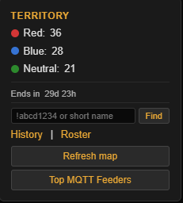
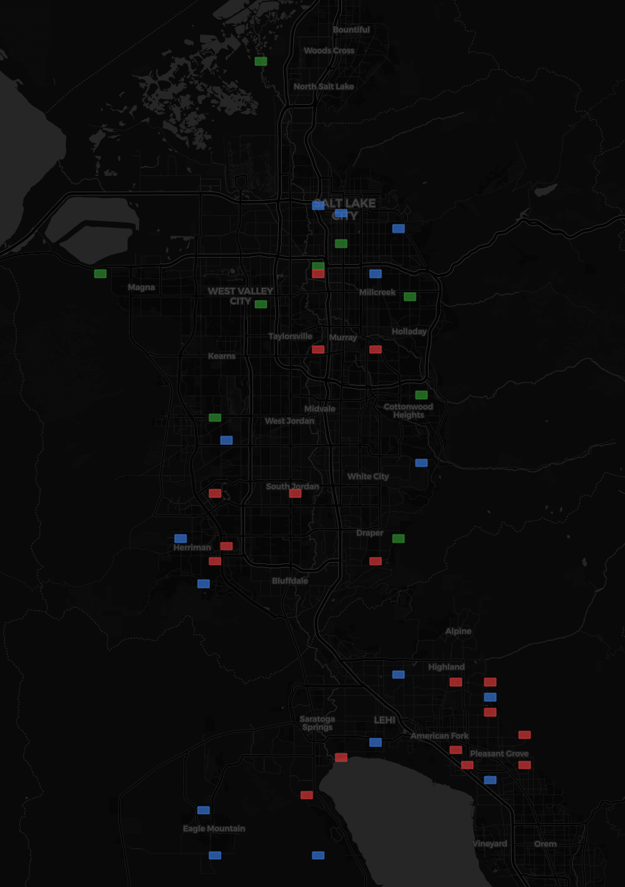
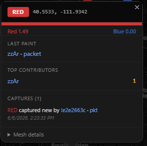
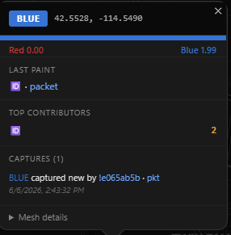

# MeshWars

A territory control game for the [Meshtastic](https://meshtastic.org/) mesh network.




MeshWars attaches to any [meshview](https://github.com/armooo/meshview) instance and turns its position-packet stream into a 30-day team game. Active nodes are snake-drafted into Team Red and Team Blue. As nodes broadcast their positions, they paint the geohash tile they're in their team color. Tiles accumulate fortress scores (effort, unique contributors, time-decay) that defend them against capture. Whichever team holds more tiles when the season ends, wins.


 


## Features

- **Auto-attaches to any meshview** — point at a URL, that's it
- **30-day seasons** with snake-draft team balancing on log-scaled activity
- **Fortress scoring** per tile — effort points, unique-contributor bonuses, day-over-day decay
- **15-minute defense window** prevents instant re-flipping after capture
- **Per-node-per-tile cooldown** stops paint spam
- **Auto-assignment** of new nodes as they appear (no manual roster management)
- **Live map** with auto-refresh, team color tiles, scoreboard, countdown, history view
- **Team lookup** — search any node by hex id or short name to see which team they're on
- **Rich tile popups** with capture history, top contributors, and links back to meshview
- **Single Docker container**, SQLite storage, no external dependencies

## Quick start

```bash
git clone https://github.com/zvx-echo6/meshwars.git
cd meshwars
cp .env.example .env
# Edit .env and set MESHVIEW_BASE_URL=https://your.meshview.example.net
docker compose up -d --build
```

Open `http://localhost:8090`.

## Configuration

All settings live in `.env`. See `.env.example` for the full list. The only required setting is `MESHVIEW_BASE_URL`. Everything else has sensible defaults.

## How it works

When a node sends a position packet, MeshWars:

1. Confirms it travelled through the mesh (filters by `hop_start - hop_limit`)
2. Encodes the sender's lat/lon to a geohash tile
3. Awards points to the sender's team for that tile (`+0.5` effort, `+1.0` if first time for that team on that tile)
4. Checks whether the sender's team can capture the tile (not the current owner, defense window expired, score now exceeds defender's)
5. Flips the tile if so — the defender's score resets, the attacker's becomes the new defense

Tile fortress scores decay over time, so abandoned territory becomes easier to take. Active painters defend better.

## Game rules

- **Sender owns the tile.** Feeders/gateways only confirm a position was actually transmitted. The team that owns the tile is the team of the node that most recently captured it.
- **Captures require beating the defender's score** (with a 15-minute immunity window after each capture).
- **Auto-assignment** — first time a previously-unknown node sends a qualifying position packet, it's auto-assigned to whichever team is currently smaller.
- **Excluded roles** — `ROUTER`, `ROUTER_LATE`, `CLIENT_BASE` don't play (configurable).
- **End of season** — tile counts tallied, winner declared (or tie), banner shows for 72 hours, fresh draft + reset.

## Endpoints

| Endpoint | Purpose |
|---|---|
| `GET /` | Map UI |
| `GET /config` | Map center, season info, scoreboard |
| `GET /get-nodes` | Coverage tiles with `owner_team` |
| `GET /tile/{geohash}` | Rich tile popup data |
| `GET /scores` | Live tile counts per team |
| `GET /history` | Last 12 closed seasons |
| `GET /teams` | Full roster |
| `GET /team/{node_ref}` | Lookup a node's team |
| `GET /health` | Health check |

## License

MIT License

Copyright (c) 2026 zvx-echo6

Permission is hereby granted, free of charge, to any person obtaining a copy
of this software and associated documentation files (the "Software"), to deal
in the Software without restriction, including without limitation the rights
to use, copy, modify, merge, publish, distribute, sublicense, and/or sell
copies of the Software, and to permit persons to whom the Software is
furnished to do so, subject to the following conditions:

The above copyright notice and this permission notice shall be included in all
copies or substantial portions of the Software.

THE SOFTWARE IS PROVIDED "AS IS", WITHOUT WARRANTY OF ANY KIND, EXPRESS OR
IMPLIED, INCLUDING BUT NOT LIMITED TO THE WARRANTIES OF MERCHANTABILITY,
FITNESS FOR A PARTICULAR PURPOSE AND NONINFRINGEMENT. IN NO EVENT SHALL THE
AUTHORS OR COPYRIGHT HOLDERS BE LIABLE FOR ANY CLAIM, DAMAGES OR OTHER
LIABILITY, WHETHER IN AN ACTION OF CONTRACT, TORT OR OTHERWISE, ARISING FROM,
OUT OF OR IN CONNECTION WITH THE SOFTWARE OR THE USE OR OTHER DEALINGS IN THE
SOFTWARE.
