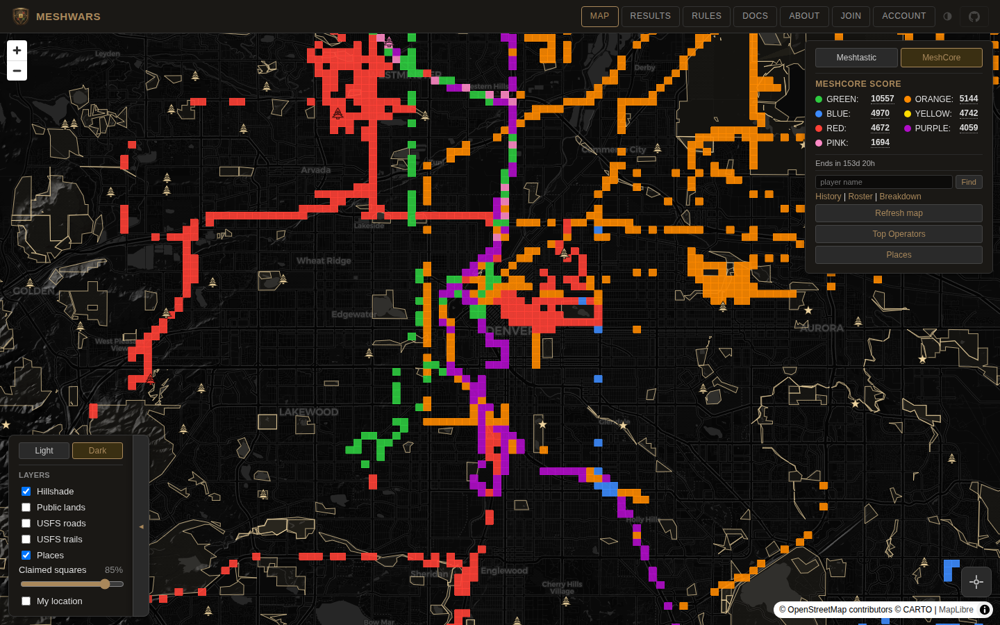
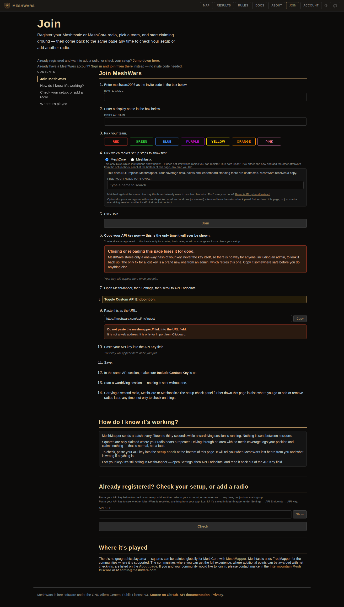
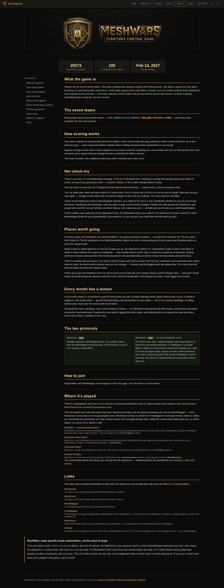

# MeshWars

A territory control game played over mesh radio. Seven teams claim roughly 300 meter squares of ground by reaching the mesh from them.



## What it is

MeshWars turns a mesh radio network into a live map game. Players carry a radio, get out into the world, and paint the square they are standing in for their team by reaching the mesh from it. A square can be captured, held, and eventually lost to a rival team, so the map keeps shifting as players spread out and defend their ground.

## Two boards, two protocols

MeshWars currently runs two separate games side by side, one per radio protocol, because they get position data in very different ways.

**MeshCore is the live one.** Position comes from [MeshMapper](https://meshmapper.net), a wardriving app MeshCore players already use to map repeater coverage. Players configure MeshMapper to forward a copy of its wardrive to MeshWars alongside whatever it already does. There is no pull API on the MeshCore side and none is attempted — MeshWars only receives what MeshMapper chooses to forward. That forward is a documented feature of the app, and it is additive: turning it on for MeshWars does not change what MeshMapper does for the player, and a player's coverage and standing there are unaffected either way.

**Meshtastic still runs the older system.** It polls a public [meshview](https://github.com/armooo/meshview) instance and picks up node positions automatically as they broadcast — no registration needed, snake-draft team balancing, geohash tiles. It is being migrated to the same player-registration model and flat grid the MeshCore board uses. Until that migration lands, registering a Meshtastic node at `/join` binds the radio and gets it ready for the change, but does not yet affect standing on that board; it still runs on its own separate rules underneath.

## How scoring works

A ping earns a tenth of a point for every repeater it hears, capped at one point total. A ping that hears no repeaters scores nothing and claims nothing — reaching the mesh is the whole point, not just being outdoors with a radio on.

The first time a given player paints a square for their team, that paint also earns a one-time half-point bonus, but only if the paint itself scored points in the first place.

An unclaimed square goes to whichever team paints it first. Once a square is captured it cannot be flipped for fifteen minutes, no matter the score — a fresh capture gets a defended window. After that, the square falls to any team that out-scores the current holder, but only the holder: with seven teams in play there is no single rival, so a challenger is only ever measured against whoever holds the square right now, not against every other team's score there.

Scores decay a quarter point a day, so an abandoned square gets easier to take the longer nobody defends it. The same player cannot repaint the exact same square within five minutes, which stops one person sitting still from running the score up by spamming pings.

## Net check-ins

Alongside squares, a second activity earns points: checking in on the weekly net, held Wednesday evenings. A qualifying check-in earns a registered player's team `CHECKIN_POINTS` (25 by default) once per player per net — posting several times in one net does not multiply the award, it is credited exactly once, same as everyone else's single check-in.

Check-in points add to a team's total alongside its square count; they do not replace it. Wardriving and checking in are two ways to contribute, not two classes of player — the same player can do both and shows up in both counts.

To be credited, a check-in has to resolve to a registered player's radio. On Meshtastic that's the registered node ID. On MeshCore it's the registered contact, which [MeshMapper](https://meshmapper.net) binds automatically the first time a player wardrives, or a player can pick their node from a searchable list on the join page at registration instead. A MeshCore player whose public key has never shown up in the directory MeshWars checks first has a last-resort fallback: a self-declared check-in name, set from the join page's setup-check panel.

Off by default — a fresh install has not configured either upstream feed and must not start polling a third-party service it was never told about. See `.env.example`'s `CHECKIN_*` and `MC_CHECKIN_*`/`MT_CHECKIN_*` settings to turn it on.

## The grid

Squares are 0.0027 degrees of latitude by 0.00384 degrees of longitude — a fixed grid, not geohash, so every square is the same size everywhere rather than warping with latitude. That size matches MeshMapper's own wardriving grid, so the game board and MeshMapper's coverage map describe the same ground. The grid's origin assumption is carried over from reading MeshMapper's behavior rather than its source, and has not been verified against MeshMapper's own implementation.

## Joining

Registration is at `/join` and requires an invite code. The code is off by default — an unconfigured install cannot be registered against at all, deliberately, since an empty code must never be treated as an open door.



A successful registration shows an API key once, and the page walks a MeshCore player through configuring MeshMapper to forward to MeshWars, including a link that page can hand straight to the app. Because that key is shown exactly once, the join page also has a self-service setup check: paste the key back in and it reports when MeshWars last heard from that player and, if something's wrong, what.

## Privacy

No raw latitude or longitude from MeshCore ever reaches the database. A position is collapsed to its grid square in the background worker before anything is written — the database only ever knows which square a ping came from, never the exact point. Repeater observations are recorded against squares, never against players, so there is no way to reconstruct a player's path from what gets stored.

There is an opt-in raw batch log for diagnosing MeshMapper's payloads while tuning thresholds. It is off by default, and when it is on it writes to a rotating file on disk, never to the database — it exists to be switched on briefly and switched back off, not left running.

## Operating it

Configuration lives in `.env`. It runs as a single Docker container via `docker compose`, backed by SQLite — no external services required. An administrative interface exists for revoking keys and managing players; it is disabled entirely unless a token is explicitly configured.

## Project status

The MeshCore board is live and in beta with real players. The Meshtastic migration to the same player model and grid is planned but not started. There is no automated test suite. The map currently sends the full board to every client on every load, which will not scale as the number of squares grows.



## Quick start

```bash
git clone https://github.com/zvx-echo6/meshwars.git
cd meshwars
cp .env.example .env
# Edit .env: set MESHVIEW_BASE_URL, and if you want MeshCore registration
# open, set JOIN_INVITE_CODE.
docker compose up -d --build
```

Open `http://localhost:8090`.

## Configuration

All settings live in `.env`. See `.env.example` for the full list. `MESHVIEW_BASE_URL` is required for the Meshtastic board to have anything to poll; everything else, including whether MeshCore registration is open at all, has a safe default and can be left as-is. See `.env.example`'s comments for what each setting does.

## License

MIT License

Copyright (c) 2026 zvx-echo6

Permission is hereby granted, free of charge, to any person obtaining a copy
of this software and associated documentation files (the "Software"), to deal
in the Software without restriction, including without limitation the rights
to use, copy, modify, merge, publish, distribute, sublicense, and/or sell
copies of the Software, and to permit persons to whom the Software is
furnished to do so, subject to the following conditions:

The above copyright notice and this permission notice shall be included in all
copies or substantial portions of the Software.

THE SOFTWARE IS PROVIDED "AS IS", WITHOUT WARRANTY OF ANY KIND, EXPRESS OR
IMPLIED, INCLUDING BUT NOT LIMITED TO THE WARRANTIES OF MERCHANTABILITY,
FITNESS FOR A PARTICULAR PURPOSE AND NONINFRINGEMENT. IN NO EVENT SHALL THE
AUTHORS OR COPYRIGHT HOLDERS BE LIABLE FOR ANY CLAIM, DAMAGES OR OTHER
LIABILITY, WHETHER IN AN ACTION OF CONTRACT, TORT OR OTHERWISE, ARISING FROM,
OUT OF OR IN CONNECTION WITH THE SOFTWARE OR THE USE OR OTHER DEALINGS IN THE
SOFTWARE.
