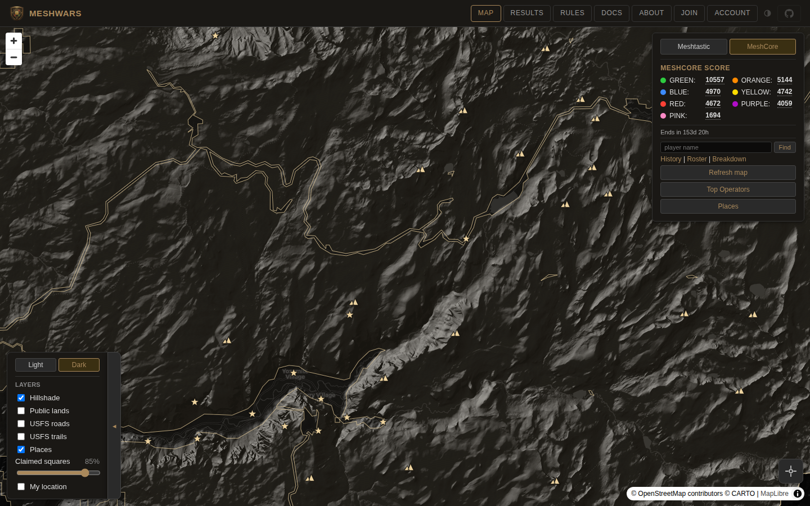
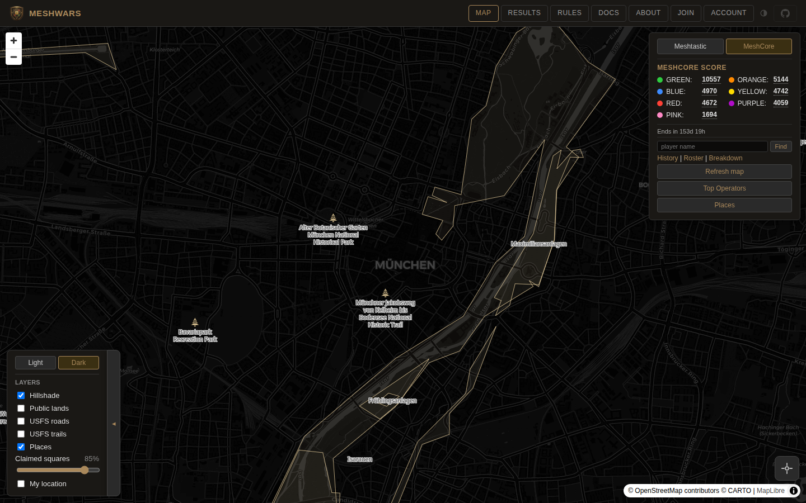
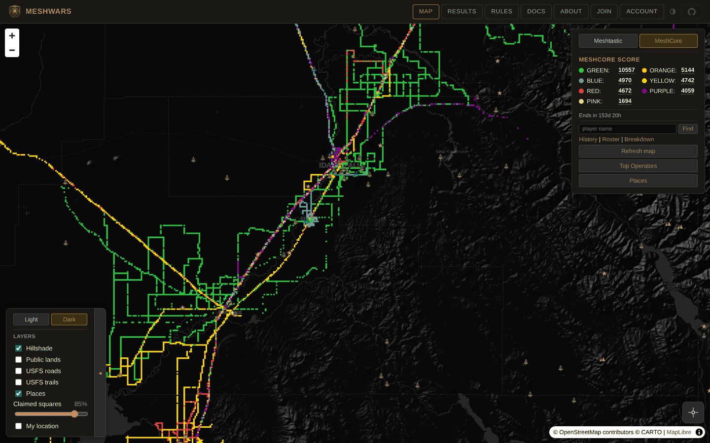

**About this project.** MeshWars was built with [Claude](https://claude.ai). The game is inspired by [MeshMapper](https://meshmapper.net) — the board is deliberately aligned to MeshMapper's own wardriving grid, so a square here and a square there describe the same ground — and by the communities where it's played: [FREQ51](https://freq51.net), [Mountain West Mesh](https://mwmesh.com), [Colorado Mesh](https://coloradomesh.org), and Central Oregon MeshCore.

# MeshWars

A territory control game played over mesh radio. Seven teams claim roughly 300 meter squares of ground by reaching the mesh from them.


## What it is

MeshWars turns a mesh radio network into a live map game. Players carry a radio, get out into the world, and paint the square they are standing in for their team by reaching the mesh from it. A square can be captured, held, and eventually lost to a rival team, so the map keeps shifting as players spread out and defend their ground.

## Two boards, two protocols

MeshWars runs the same game on both radio protocols: seven teams, registered players, the same flat grid of squares. The two boards differ only in how position reaches the server, because MeshCore and Meshtastic hand us that data in very different ways.

**MeshCore is pushed.** Position comes from [MeshMapper](https://meshmapper.net), a wardriving app MeshCore players already use to map repeater coverage. Players configure MeshMapper to forward a copy of its wardrive to MeshWars alongside whatever it already does. There is no pull API on the MeshCore side and none is attempted — MeshWars only receives what MeshMapper chooses to forward. That forward is a documented feature of the app, and it is additive: turning it on for MeshWars does not change what MeshMapper does for the player, and a player's coverage and standing there are unaffected either way.

**Meshtastic is pulled.** MeshWars polls a public [meshview](https://github.com/armooo/meshview) instance and picks up node positions as they broadcast, but only scores them for a registered player — a packet from a node nobody has registered at `/join` is read by the poller and discarded, the same way a MeshCore contact nobody registered never reaches a square. Registering a node at `/join` is what puts it on the board at all.

## How scoring works

A ping earns a tenth of a point for every repeater it hears, capped at one point total. A ping that hears no repeaters scores nothing and claims nothing — reaching the mesh is the whole point, not just being outdoors with a radio on.

The first time a given player paints a square for their team, that paint also earns a one-time half-point bonus, but only if the paint itself scored points in the first place.

An unclaimed square goes to whichever team paints it first. Once a square is captured it cannot be flipped for fifteen minutes, no matter the score — a fresh capture gets a defended window. After that, the square falls to any team that out-scores the current holder, but only the holder: with seven teams in play there is no single rival, so a challenger is only ever measured against whoever holds the square right now, not against every other team's score there.

Scores decay a quarter point a day, so an abandoned square gets easier to take the longer nobody defends it. The same player cannot repaint the exact same square within five minutes, which stops one person sitting still from running the score up by spamming pings.

## Places worth going

Squares are not the only thing on the board. Summits, parks and landmarks are scored separately, as a reason to go somewhere specific rather than simply cover ground. Reaching one earns points toward both a personal Explorer Score and the team total, once per place per week, capped at 100 points a player a week.

**Credit is for reaching a place, not for getting inside it.** A landmark credits from the square it sits in and the ring of squares around it, so a museum counts from the pavement outside and a fenced site counts from its perimeter. A large park stores the band of squares along its boundary rather than its filled interior: arriving at a national park is the achievement, and travelling further into it is not separately rewarded. Summits are the exception — they use an elevation-derived activation zone rather than a flat ring, because reaching the summit is the point of that mode.

Effort decides the value. A park or landmark inside a city is worth 5; out in the country a landmark is 10 and a park 25; a summit scales from 50 to 100 with elevation. Size is deliberately not the axis — a big park near a city is an easy afternoon, and is priced like one.

**The board is worldwide.** It holds a little over two million places, drawn from [SOTA](https://sotadata.org.uk) summits, [POTA](https://pota.app) parks, the US government's PAD-US protected-areas database, and OpenStreetMap. Coverage follows OpenStreetMap's own mapping density rather than anything MeshWars decides, so it is dense across Europe, Japan and North America and thin where OSM itself is thin.

Nowhere shows all of them at once. Places rotate weekly, and how many are live in an area scales with how crowded it is — from 15 in a quiet cell up to 60 in a dense city, spaced at least a mile apart. A player sees a handful worth driving to, not a wall of markers.



*A park is stored as its real boundary, so it credits from any of its entrances — Tioga Pass, Hetch Hetchy and the valley floor are 40 to 60 km apart and all count as Yosemite. Triangles are summits, stars are landmarks.*



*The same board in Munich. Coverage outside the US comes from OpenStreetMap, so it is dense wherever OSM itself is dense.*

## Net check-ins

Alongside squares, a second activity earns points: checking in on the weekly net, held Wednesday evenings. A qualifying check-in earns a registered player's team `CHECKIN_POINTS` (25 by default) once per player per net — posting several times in one net does not multiply the award, it is credited exactly once, same as everyone else's single check-in.

Check-in points add to a team's total alongside its square count; they do not replace it. Wardriving and checking in are two ways to contribute, not two classes of player — the same player can do both and shows up in both counts.

To be credited, a check-in has to resolve to a registered player's radio. On Meshtastic that's the registered node ID. On MeshCore it's the registered contact, which [MeshMapper](https://meshmapper.net) binds automatically the first time a player wardrives, or a player can pick their node from a searchable list on the join page at registration instead. A MeshCore player whose public key has never shown up in the directory MeshWars checks first has a last-resort fallback: a self-declared check-in name, set from the join page's setup-check panel.

Off by default — a fresh install has not configured either upstream feed and must not start polling a third-party service it was never told about. See `.env.example`'s `CHECKIN_*` and `MC_CHECKIN_*`/`MT_CHECKIN_*` settings to turn it on. Setting `CHECKIN_ENABLED=true` is not enough by itself: `CHECKIN_NET_START_DATE` also has to be set to the date of the first net that should count. It defaults to empty, and empty means block every net, not "no lower bound" — leave it unset and check-ins run with no visible error but award nothing at all, because every net still in the feed is older than the (missing) start date.

## The grid

Squares are 0.0027 degrees of latitude by 0.00384 degrees of longitude — a fixed grid, not geohash, so every square is the same size everywhere rather than warping with latitude. That size matches MeshMapper's own wardriving grid, so the game board and MeshMapper's coverage map describe the same ground. The grid's origin assumption is carried over from reading MeshMapper's behavior rather than its source, and has not been verified against MeshMapper's own implementation.

## Joining

Registration is at `/join` and requires an invite code. The code is off by default — an unconfigured install cannot be registered against at all, deliberately, since an empty code must never be treated as an open door.


A successful registration shows an API key once, and the page walks a MeshCore player through configuring MeshMapper to forward to MeshWars, including a link that page can hand straight to the app. Because that key is shown exactly once, the join page also has a self-service setup check: paste the key back in and it reports when MeshWars last heard from that player and, if something's wrong, what. That same panel is also where radios get managed after the fact — add or remove one, on either protocol, any time, using nothing but the key. That covers a MeshCore contact's three routes into the player registry: MeshMapper auto-binds it on first wardrive, a player can pick it from a searchable list at registration, or add it later from this panel. A Meshtastic node, which cannot self-bind at all, always goes through the last two.

## Privacy

No raw latitude or longitude from MeshCore ever reaches the database. A position is collapsed to its grid square in the background worker before anything is written — the database only ever knows which square a ping came from, never the exact point. Repeater observations are recorded against squares, never against players, so there is no way to reconstruct a player's path from what gets stored.

There is an opt-in raw batch log for diagnosing MeshMapper's payloads while tuning thresholds. It is off by default, and when it is on it writes to a rotating file on disk, never to the database — it exists to be switched on briefly and switched back off, not left running.

## Operating it

Configuration lives in `.env`. It runs as a single Docker container via `docker compose`, backed by SQLite — no external services required. An administrative interface exists at `/admin`; it is disabled entirely unless `ADMIN_TOKEN` is explicitly configured, since that token is the only authentication this application has anywhere.

From there an operator can revoke a key, disable or delete a player, and add or remove a player's radios directly — fixing someone's setup never requires their key at all. A key is a SHA-256 hash in storage; the raw value is shown exactly once, at issuance, and is never recoverable after that, by anyone, including an admin. There are two separate remedies for that, not one, because "I lost my key" and "someone else has my key" call for opposite responses: issuing an *additional* key leaves every existing key working, for a player who just mislaid theirs and whose MeshMapper config should keep running untouched; reissuing revokes every key the player currently holds and replaces them with one new one, for a key that actually leaked, at the cost of breaking that player's setup until they reconfigure it with the new key.

## Project status

The MeshCore board is live, out of beta, and played by over a hundred registered players across several mesh communities. The Meshtastic board now runs the same player model and grid, differing only in how position reaches it: pulled from a public meshview instance and scored only for registered nodes. There is no automated test suite. The map currently sends the full board to every client on every load, which will not scale as the number of squares grows.



*The same game in east Idaho, where it started. Each community's board looks different because it is shaped by wherever people actually drive.*


## Quick start

```bash
git clone https://github.com/zvx-echo6/meshwars.git
cd meshwars
cp .env.example .env
# Edit .env: set MESHVIEW_BASE_URL, and if you want MeshCore registration
# open, set JOIN_INVITE_CODE.
mkdir -p data/data data/tiles
docker compose up -d --build
```

Open `http://localhost:8090`. The board comes up empty of places until you also add the Places Worth Going seed at `./data/data/places_worth_going.csv.gz` — see "Where the data and tiles live" below.

### Who it runs as

MeshWars runs as an unprivileged user, never root. The image builds its
own account at uid/gid **1000** — the first regular account on most
Linux systems, so on a single-user machine that is already you, and the
files the app writes come out owned by you rather than by root.

If your account is a different id, set `PUID` and `PGID` in `.env` to
the output of `id -u` and `id -g`. That is a runtime override, so
`docker compose up -d` picks it up with no rebuild.

| Setting | Default | What it is |
| --- | --- | --- |
| `PUID` | `1000` | uid the container process runs as. Must own `./data`. |
| `PGID` | `1000` | gid the container process runs as. |

Whoever that is has to own the data directory, or the app cannot write
its database:

```bash
sudo chown -R "$(id -u):$(id -g)" ./data
```

### Where the data and tiles live

Both live in `./data`, beside `docker-compose.yml` — plain directories
you own, not docker-managed volumes, so ordinary tools can back them up
and move them.

| Path | Mounted at | What it is |
| --- | --- | --- |
| `./data/data` | `/data` | The SQLite database (`game.db`) and its `-wal`/`-shm` sidecars, **and** the Places Worth Going seed (`places_worth_going.csv.gz`, or a decompressed `.csv`). Must be writable by `PUID:PGID` — the **directory**, not just the file, because that is where SQLite creates the sidecars. |
| `./data/tiles` | `/tiles-data` (read-only) | Optional PMTiles overlay archives (hillshade, public lands, USFS roads and trails). Read-only, so ownership does not matter. Leave it empty and the map just draws without the overlays. |

**The places seed is not included in this repository.** It is large (tens to well over 100MB) and grows with every rebuild, and git cannot diff compressed data, so it is not tracked here — see `docs/features/places.md`. Without `./data/data/places_worth_going.csv.gz` in place, MeshWars starts and runs normally, but the board has **zero places**: no summits, parks, or landmarks, and no error on startup, just a clear warning in the logs naming the exact path it looked for. (The one exception is an image or checkout built before the seed moved out of the repo that still happens to carry the old `app/reference/places_worth_going.csv.gz` on disk — the loader falls back to that copy rather than booting empty, and says in the logs that it did so. A fresh clone never has that file, so it still comes up with zero places until you supply one.) Build one yourself with `scripts/build_places_seed.py`'s `merge` stage (see that script's own `--help` and `docs/features/places.md`), or obtain a copy from wherever your instance's operator distributes it.

These paths are set in `docker-compose.yml` directly; edit that file if
you want them somewhere else.

**Upgrading an existing install.** Two things changed and both are
one-time:

- Releases before this one stored the database in a docker named volume
  called `meshwars-data`. Copy `game.db` out of it into `./data/data`
  with the container stopped. Starting against an empty `./data/data`
  brings the site up looking wiped — no players, no squares, no history
  — because the real database is still in the volume nothing reads any
  more.
- Those files were written by a root container, so they are root-owned.
  Run the `chown` above once, or the non-root app cannot open them.

## Configuration

All settings live in `.env`. See `.env.example` for the full list. `MESHVIEW_BASE_URL` is the only setting with no default, so it is required to start the process at all — even on a deployment that only cares about the MeshCore board. Everything else, including whether MeshCore registration is open at all, has a safe default and can be left as-is. See `.env.example`'s comments for what each setting does.

## Thanks

Special thanks to **Hunter** and **Littleaton** for creative ideas and for help with the back-end connections.

Thanks to everyone sending feedback while this is being built, and to every player past, present and future.

And to the mesh networks this runs on and across:

- [FREQ51](https://freq51.net)
- [Mountain West Mesh](https://mwmesh.com)
- [Idaho Mesh](https://idahomesh.com)

## License

MeshWars is licensed under the GNU Affero General Public License, version 3 or later. Copyright (c) 2026 Matthew Johnson. Full text in [LICENSE](LICENSE).

In practice that means you are free to run, study, modify and share it. The one condition that goes beyond a typical open source license is section 13: if you run a modified version as a network service, you have to offer that version's source to the people using it, not just to people you hand a copy to directly.

The MeshWars name and logo are not licensed with the code. A fork is welcome, but it has to run under its own name.
