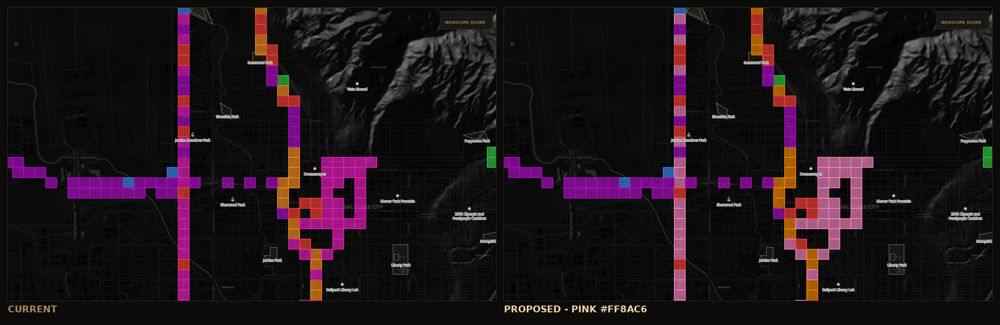
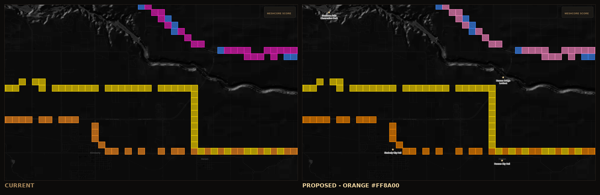
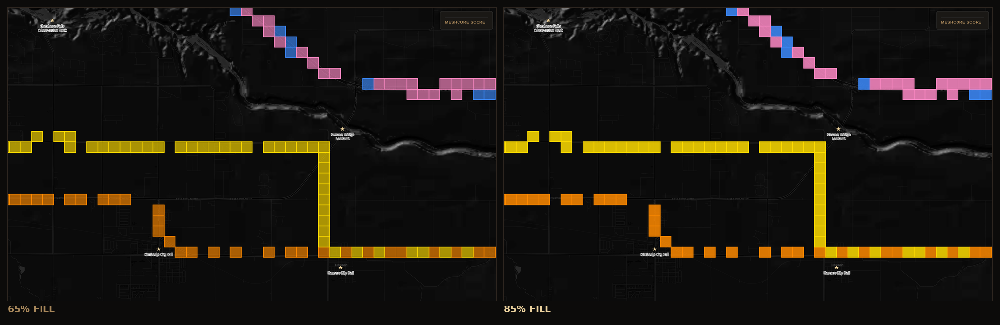
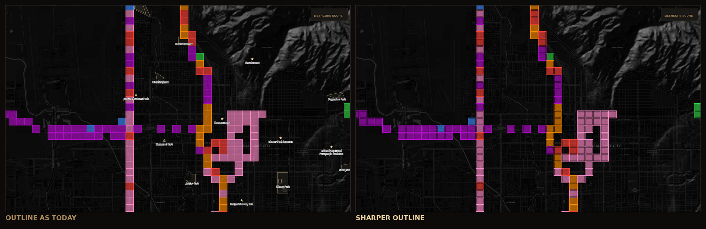

# Board Colors

Two of the seven team colors are hard to tell apart on the map: purple against pink, and orange against yellow. What follows is the design conversation written down so it does not have to be had again — what was measured, what was tried and reversed, and what is actually worth changing.

Every number here is CIEDE2000 measured on the **composited fill** — the color that reaches the screen after `board-fill`'s 65% opacity lands on the basemap — not on the raw token. That distinction turns out to be the whole story. As a rough scale: 1.0 is the smallest difference a trained eye catches side by side, and anything under about 12 is easy to mistake across a map.

## What is actually wrong

| Pair | Separation on screen |
|---|---|
| purple / pink | **9.8** |
| red / orange | 22.2 |
| yellow / orange | 23.4 |
| everything else | 27.3 and up |

Purple and pink are the closest pair on the board by a factor of two, and it is not close. They sit 15° apart in hue — `#b10dc9` at 323.5°, `#f01ec0` at 338.6° — both in the magenta corner, with only 11 points of lightness between them. Two teams occupy one color.

Orange and yellow are a different complaint with a different cause. At 23.4 they are not numerically close, but they read as one family because both are bright warm colors 30° apart, and because the fill opacity flattens them (below).

## The fill is eating a third of every color

At 65% opacity over the near-black basemap, `#ffdc00` reaches the screen as `#af9a0d` — a dark olive. The blue channel is gone and the red channel is capped at `af`, which means **no brighter yellow can help**: every `#ffXXXX` value composites to the same `#af....` red channel. The alpha is what dulls it, not the hex.

This is the fact that makes several obvious fixes wrong, and it is why the note keeps quoting composited values alongside tokens.

## The two hexes

| Team | Now | Proposed | On screen at 65% |
|---|---|---|---|
| PINK | `#f01ec0` | `#ff8ac6` | `#a51e89` → `#af658d` |
| ORANGE | `#ff9020` | `#ff8a00` | `#af6821` → `#af650d` |

**Purple, blue, red, green and yellow keep their exact values.** Purple did not need to move; pink did.

Pink separates from purple by going **up in lightness** rather than sideways in hue — L 55.3 → 71.9, which puts 28 points of lightness between the two teams and leaves purple's identity untouched. Purple against pink goes 9.8 → 23.7, and the closest pair anywhere on the board goes 9.8 → 23.3.

Orange holds the red channel at `ff` and drops the green channel instead of darkening. Its composited brightness is therefore identical to today's (`af` in both), it just carries less yellow. This is the constraint that matters for orange: any value that lowers the red channel composites to a brown.

`#ff8a00` is the balance point rather than an arbitrary pick. Pushing further toward red keeps improving orange against yellow but spends it on red against orange:

| Orange | On screen | vs yellow | vs red | Board floor |
|---|---|---|---|---|
| `#ff9600` | `#af6c0d` | 20.2 | 26.2 | 20.2 |
| `#ff9020` (today) | `#af6821` | 23.4 | 22.2 | 22.2 |
| **`#ff8a00`** | `#af650d` | 23.4 | 23.3 | **23.3** |
| `#ff8000` | `#af5e0d` | 26.5 | 20.5 | 20.5 |
| `#ff7a10` | `#af5a17` | 28.9 | 17.7 | 17.7 |

Pink is the one genuine judgement call, and it is a slider rather than a single answer — it trades separation from purple against separation from red. All four clear the floor:

| Pink | On screen | vs purple | vs red | Board floor | |
|---|---|---|---|---|---|
| `#ff7fc0` | `#af5d89` | 21.9 | 23.1 | 21.9 | hotter |
| **`#ff8ac6`** | `#af658d` | 23.7 | 24.0 | **23.3** | proposed |
| `#ff97cd` | `#af6d92` | 25.6 | 25.3 | 23.3 | paler |
| `#ffa0d0` | `#af7394` | 27.3 | 25.9 | 23.3 | palest |

Pink also stops failing contrast as text: 4.77 → 8.19 against `--mw-panel`. Purple stays at 3.18, so `--mw-team-purple-text` stays exactly as it is.

## Fill opacity is what fixes orange against yellow

The two hexes buy **nothing** for that pair — 23.4 before, 23.4 after. Orange cannot go darker without going brown, and yellow cannot go brighter at all. The lever is `BOARD_FILL_OPACITY`, one constant, reversible in one line:

| | 0.65 | 0.85 |
|---|---|---|
| yellow on screen | `#af9a0d` | `#ddc005` |
| orange on screen | `#af650d` | `#dd7a05` |
| yellow / orange | 23.4 | **26.7** |
| purple / pink | 23.7 | **29.1** |
| board floor | 23.3 | 24.0 |

It lifts every pair at once, and it is the only change in this note that improves the color-vision cases as well. The cost is that held ground covers more of the hillshade and street grid underneath, which is a taste call rather than a correctness one.

## Outlines

`board-line` already draws each cell's edge in the **same** team color at **full** opacity. The layer is created at `line-width: 1`, but `applyBasemapTheme()` overrides it to `BOARD_LINE_WIDTH[theme]` — 2 for both themes — on load, so the effective rim is 2 px.

That rim is the only place a team's undiluted color reaches the screen, and it carries more separation than the fill beneath it does:

| | Fill (65%) | Outline (100%) |
|---|---|---|
| today | 9.8 | **14.3** |
| with the two hexes | 23.3 | **24.3** |

The board has been saying more than it draws. Two paint properties and one added layer put it on screen, all on the existing `board` source:

```js
map.addLayer({
  id: 'board-sep', type: 'line', source: 'board',
  paint: { 'line-color': '#000000', 'line-width': 5, 'line-opacity': 0.9 },
}, 'board-line');                      // beforeId — under the team rim, over the fill
map.setPaintProperty('board-line', 'line-width', 3);
```

The dark gutter stops neighbouring cells bleeding into one another, and the wider rim gives every cell an edge of its own true hue. **This needs zoom interpolation before it ships** — a 5 px gutter would swallow a 300 m cell at regional zoom — and the widths above must be set after `applyBasemapTheme()` runs, not in the `addLayer` literal, or the theme pass overwrites them.

That zoom interpolation now exists, as `BOARD_SEP_WIDTH_ZOOM` and `BOARD_LINE_WIDTH_ZOOM` in `frontend/map2.js`, both set from `applyBasemapTheme()` rather than from the `board-sep`/`board-line` `addLayer` calls, for exactly the reason above. The gutter runs `0` at zoom 11 up to `5` at zoom 16 (`11,0, 12,0.6, 13,1.5, 14,3, 15,4, 16,5`), so it stays out of the way at regional zoom and only reaches its full width once a cell is large enough to carry it. The rim runs `1.5` at zoom 11 up to `3` at zoom 16 (`11,1.5, 13,2, 14,2.5, 15,3, 16,3`), holding close to today's effective 2 px rim until there is also room for the gutter beside it.

## Color vision

| Vision | Now | Two hexes | + 85% fill | Limiting pair at the end |
|---|---|---|---|---|
| Normal | 9.8 | 23.3 | 24.0 | red / orange |
| Deuteranopia | 5.5 | 5.5 | 6.1 | red / green |
| Protanopia | 4.2 | **8.2** | 8.2 | green / yellow |
| Tritanopia | 8.7 | 7.7 | 8.4 | orange / pink |

Purple against pink was the worst pair on the entire board for a protanope, at 4.2; it clears to 8.2. Tritanopia gives up 1.0 on orange against pink, which affects on the order of one player in ten thousand.

Deuteranopia does not move, and it cannot be moved by a palette. Searching the whole sRGB gamut for the seven colors that maximise the worst pair under deuteranopia **and** protanopia at once returns a minimum separation near 16 — three times what this board manages — and every one of those seven comes out a green, a teal or a blue:

`#78ad00` `#8dfa00` `#9ef1ca` `#009c6d` `#45949d` `#00dcff` `#1088ff`

There is no red, no orange, no pink and no purple in a set that clears that bar. Since the team **is** the color, in the code and in how players talk about the board, a colorblind palette would have to rename the teams — and a per-viewer palette would make "pink holds that block" false for the next player.

So the answer for color vision is not a different palette. It is a second channel that is not color at all: a per-team `fill-pattern` on `board-fill` — solid, diagonal left, diagonal right, dots, cross-hatch, horizontal, vertical — faded in above a zoom threshold so the regional view stays clean. That works for every kind of color blindness at once and in greyscale, and it keeps the map meaning the same thing for everyone. The outline treatment above is the first half of that idea. One trap when it is built: MapLibre swallows a throw inside `addImage` silently, so a broken pattern shows up as a blank layer with no error anywhere.

## Purple against pink



## Orange against yellow



## What the fill opacity does



## What the outlines do



## Tried and reversed

**Darkening orange to `#ea8000`.** It composites to `#a25e0d`, which is brown. The 65% fill had already taken a third of the brightness; taking more of it left orange reading as mud. Rejected on sight, and correctly — the numbers looked fine (yellow/orange 25.1) precisely because CIEDE2000 does not care that a color has stopped looking like its own name.

**Moving purple to violet `#965fff`.** This was an attempt to separate purple from pink by hue, and it walked into blue instead of away from pink. It also made deuteranopia slightly worse, where blue and violet already sit close: blue against purple went 6.4 → 5.5. The mistake was treating purple as the color that had to move, when purple was the one with nowhere to go — blue is at 283°, pink at 339°, and purple at 323.5° is already wedged between them.

**Lightening yellow.** Every `#ffXXXX` composites to the same capped red channel at 65% opacity, so a paler yellow changes almost nothing on screen. See the opacity section.

## Code, not config

All three changes are **code**. Nothing here is reachable from settings or the admin UI.

Config knows team **names** and nothing else — `teams: str = "RED,GREEN,BLUE,PURPLE,YELLOW,ORANGE,PINK"` in `app/config.py`, read back through `teams_list()`. There is no color anywhere in `app/`, in any settings file, or in the database; the palette lives entirely in the front-end sources, and the two paint constants live beside it:

| Change | Where | Kind |
|---|---|---|
| The two hexes | seven front-end files, below | code |
| Fill opacity | `BOARD_FILL_OPACITY` in `frontend/map2.js` | code (a JS constant, per theme) |
| Outlines | `BOARD_LINE_WIDTH` in `frontend/map2.js`, plus one added layer | code |

Each page script carries its own copy of the palette on purpose, so a palette change touches seven files and no logic:

- `frontend/theme.css` — the `--mw-team-*` tokens
- `frontend/rules.css` — `.team-purple` reads `--mw-team-purple-text`, which this proposal leaves alone
- `frontend/mc.js`, `map2.js`, `join.js`, `results.js`, `account.js` — five copies of `TEAM_COLORS`
- `frontend/about.html` — needs no edit. It once had its own `--chip-color` team chips, but those were replaced with inline `class="team team-*"` prose, which resolves through `.landing-panel .team-*` in `rules.css` to the same `--mw-team-*` tokens `theme.css` already carries. Checked and confirmed empty during this change, not assumed.

A rebuild and redeploy of the container is the whole deployment; there is no live-apply path and no restart-free knob for any of it.

One more step belongs to any palette change, not just this one: bump the `?v=` cache-bust query string on every changed file in every HTML page that references it. The server sends only `ETag`/`Last-Modified`, no `Cache-Control`, so a browser is free to keep serving a returning player's already-cached copy of `theme.css` or one of the five `TEAM_COLORS` scripts for hours without ever revalidating. Skip the bump and the deploy looks like it silently failed: new visitors see the new colors, returning players see the old ones, and nothing in any log says why.

## How the images were made

Headless Chromium against the live public board at meshwars.com, 1500×950 at device scale factor 2, framed by `?lat=&lon=&zoom=` so every variant is pixel-identical. Palette and paint variants were applied at runtime through `window.__mwMap.setPaintProperty` after the board painted — the page's own theme pass sets `board-fill` opacity and `board-line` width on load, so anything set earlier is overwritten. Views: Salt Lake at 40.7735, -111.9257 zoom 12.6 (47 pink cells against 26 purple), and Twin Falls at 42.5596, -114.3323 zoom 12.6 (32 yellow against 20 orange).
